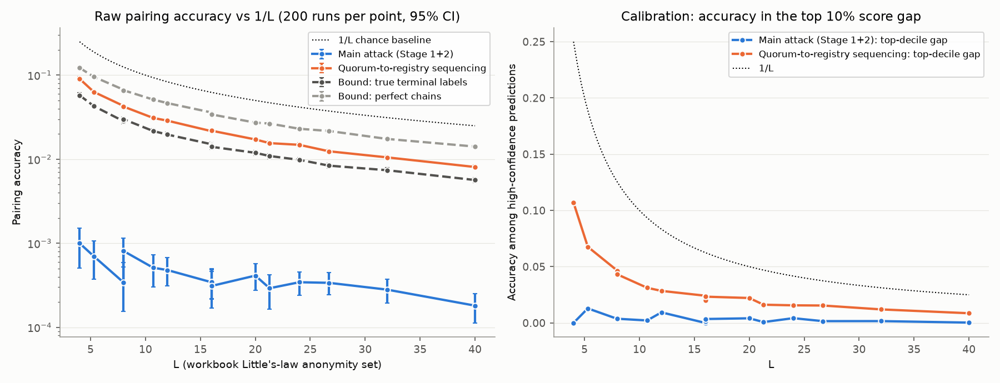
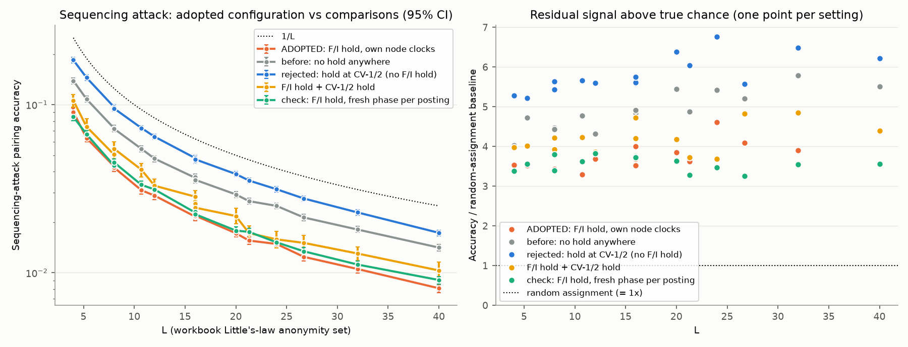

# Level 3 results

**Configuration: the adopted protocol.** Relay nodes use a node-wide lottery clock. The device holds each channel on its own, freshly drawn phase. F and I each hold their registry posting in the lottery, on their own independent node clocks, after seeing the 2-of-3 quorum. CV-1/2 has no hold. These are `params.Config`'s defaults, recorded in the workbook at Level 3 Experiment Design!B6 and B13 and Leg Catalog K26/K27.

The sweep covered all 15 settings in the workbook table, with 200 independent runs each (3,000 runs), plus probes and sensitivity checks (280 runs). Each run simulates 90 minutes of traffic, about 3 million observed messages. Only submissions made in the 40 minutes after a 20-minute warm-up are scored. The sequencing-attack comparisons (no hold anywhere, the rejected CV-1/2 hold, both holds, and a fresh-phase check) add another 9,750 runs.

Methods and every modelling choice are in [`README.md`](README.md). The machine-readable results are in `results/summary.json` and `results/summary.csv`.

## Headline

**Neither attack beat the workbook's 1/L baseline at any setting**, from L = 4 to L = 40. The upper end of every 95% confidence interval stays below 1/L. So, on the workbook's criterion, there is no L floor inside the tested range below which the attack succeeds.

- **Main attack** (chain reconstruction, then origin-time grouping). This is at chance: it pairs correctly 0.02–0.10% of the time, the same as random assignment over the same candidate pairs. Per-hop matching succeeds only 1.4–2.2% of the time, because the node-wide lottery mixes held packets almost uniformly.
- **Sequencing attack** (validator reply at C → registry posts from F and I). This leaves a real but weak signal. It scores **3.3–4.6× better than random assignment**, at 0.32–0.36 of 1/L in absolute terms.

  The signal is uncalibrated. No prediction in any setting had a top-vs-runner-up score gap of even 1 nat. Accuracy in the top 10% of score gaps is barely above overall accuracy: for example 3.1% vs 3.1% at L = 10.7, and 10.7% vs 9.1% at L = 4. The attacker can't tell which of its guesses are right.

  The adopted F/I hold narrows this signal by 35–43% compared with no hold. It does not close it.

On the workbook's two-part criterion:

1. **Raw accuracy vs 1/L.** Below 1/L everywhere, for both attacks.
2. **Calibration.** Fails for both attacks: there are no high-confidence predictions to act on.

## Main sweep (adopted configuration)

Cells show accuracy with a 95% bootstrap CI over runs. "Random assignment" means the same assignment step applied to random scores over the same feasible pairs.

| Devices | Interval (min) | L | 1/L | Main attack | Sequencing attack | Sequencing ÷ random assignment | Bound: perfect chains | Bound: true terminals | Stage 1 hop accuracy |
|---|---|---|---|---|---|---|---|---|---|
| 40 | 10 | 8 | 0.125 | 0.03% [0.02–0.06] | 4.3% [4.1–4.5] | 3.4× | 6.7% | 2.8% | 2.1% |
| 40 | 15 | 5.3 | 0.189 | 0.07% [0.04–0.11] | 6.3% [6.0–6.6] | 3.5× | 9.6% | 4.3% | 2.2% |
| 40 | 20 | 4 | 0.250 | 0.10% [0.05–0.15] | 9.1% [8.6–9.6] | 3.5× | 12.2% | 5.8% | 2.2% |
| 80 | 10 | 16 | 0.062 | 0.03% [0.02–0.05] | 2.2% [2.1–2.3] | 3.7× | 3.5% | 1.5% | 1.8% |
| 80 | 15 | 10.7 | 0.093 | 0.05% [0.03–0.07] | 3.1% [2.9–3.3] | 3.3× | 5.1% | 2.2% | 2.0% |
| 80 | 20 | 8 | 0.125 | 0.08% [0.05–0.12] | 4.2% [4.0–4.5] | 3.4× | 6.6% | 3.0% | 2.0% |
| 120 | 10 | 24 | 0.042 | 0.03% [0.02–0.05] | 1.5% [1.4–1.6] | 4.6× | 2.3% | 1.0% | 1.7% |
| 120 | 15 | 16 | 0.062 | 0.03% [0.02–0.05] | 2.2% [2.0–2.3] | 3.5× | 3.6% | 1.5% | 1.8% |
| 120 | 20 | 12 | 0.083 | 0.05% [0.03–0.07] | 2.9% [2.7–3.0] | 3.7× | 4.7% | 2.0% | 1.9% |
| 160 | 10 | 32 | 0.031 | 0.03% [0.02–0.04] | 1.1% [1.0–1.1] | 3.9× | 1.7% | 0.7% | 1.5% |
| 160 | 15 | 21.3 | 0.047 | 0.03% [0.02–0.04] | 1.6% [1.5–1.6] | 3.6× | 2.7% | 1.1% | 1.7% |
| 160 | 20 | 16 | 0.062 | 0.03% [0.02–0.05] | 2.2% [2.1–2.3] | 4.0× | 3.4% | 1.4% | 1.8% |
| 200 | 10 | 40 | 0.025 | 0.02% [0.01–0.02] | 0.8% [0.8–0.9] | 4.4× | 1.4% | 0.6% | 1.4% |
| 200 | 15 | 26.7 | 0.037 | 0.03% [0.02–0.04] | 1.2% [1.2–1.3] | 4.1× | 2.2% | 0.8% | 1.6% |
| 200 | 20 | 20 | 0.050 | 0.04% [0.03–0.06] | 1.7% [1.6–1.8] | 3.9× | 2.7% | 1.2% | 1.8% |

### Reading the bounds

The two "bound" columns are not attacks. Each uses ground truth that the observer does not have, to measure how much information exists at a given stage:

- **Perfect chains.** Stage 2 is given the true 3-hop chains. Even then it reaches only 0.49–0.58 of 1/L. The only thing tying a credential chain to its content chains is the difference of two independent device-side lottery draws.
- **True terminal labels.** This pairs Cred-3 arrivals with ContA-3/ContB-3 arrivals by timing alone, given oracle labels for which arrivals are terminals. It reaches about 0.23 of 1/L.

So **even perfect chain reconstruction would stay below 1/L.** A smarter Stage 1 is capped by the perfect-chains column.

### Why "below 1/L" is weaker than it sounds

1/L assumes the only competitors are the L submissions in flight during a 2-minute window. For the sequencing attack under the adopted hold, the real pairing window is several minutes wide, so random assignment scores 10–14× below 1/L. The sequencing attack sits above that real chance level at every setting, with tight intervals, so it leaks measurably while never crossing 1/L. The leak is weak and uncalibrated: the "materially weaker privacy failure" the workbook describes.

## Sequencing attack: adopted configuration vs before

Each cell shows sequencing-attack accuracy, then that accuracy divided by random assignment for the same variant (1× would mean no signal). All variants share the main sweep's seeds. The attacker's likelihood model is rebuilt for each variant, and a test checks it against the simulator's actual delays (`test_attacker_sequencing_model_matches_simulator`). Every column has 200 runs per setting except "F/I + CV-1/2 holds", which has 50.

| Devices | Interval (min) | L | **Adopted: F/I hold** | Before: no hold anywhere | Change | Rejected: CV-1/2 hold only | F/I + CV-1/2 holds | Check: F/I hold, fresh phase per posting |
|---|---|---|---|---|---|---|---|---|
| 40 | 10 | 8 | **4.3% (3.4×)** | 7.3% (4.5×) | −41% | 9.7% (5.4×) | 5.1% (3.9×) | 4.3% (3.4×) |
| 40 | 15 | 5.3 | **6.3% (3.5×)** | 10.8% (4.7×) | −41% | 14.5% (5.2×) | 7.4% (4.0×) | 6.7% (3.6×) |
| 40 | 20 | 4 | **9.1% (3.5×)** | 13.9% (4.0×) | −35% | 18.4% (5.3×) | 10.6% (4.0×) | 8.5% (3.4×) |
| 80 | 10 | 16 | **2.2% (3.7×)** | 3.7% (4.7×) | −42% | 4.6% (5.6×) | 2.6% (3.8×) | 2.3% (3.8×) |
| 80 | 15 | 10.7 | **3.1% (3.3×)** | 5.5% (4.8×) | −43% | 7.3% (5.7×) | 4.1% (4.2×) | 3.3% (3.6×) |
| 80 | 20 | 8 | **4.2% (3.4×)** | 7.2% (4.4×) | −41% | 9.5% (5.6×) | 5.5% (4.2×) | 4.5% (3.8×) |
| 120 | 10 | 24 | **1.5% (4.6×)** | 2.5% (5.4×) | −41% | 3.1% (6.8×) | 1.6% (3.7×) | 1.5% (3.5×) |
| 120 | 15 | 16 | **2.2% (3.5×)** | 3.7% (4.8×) | −41% | 4.8% (5.6×) | 2.8% (4.7×) | 2.3% (3.7×) |
| 120 | 20 | 12 | **2.9% (3.7×)** | 4.8% (4.3×) | −40% | 6.4% (5.6×) | 3.3% (3.9×) | 3.1% (3.8×) |
| 160 | 10 | 32 | **1.1% (3.9×)** | 1.8% (5.8×) | −42% | 2.3% (6.5×) | 1.3% (4.8×) | 1.1% (3.5×) |
| 160 | 15 | 21.3 | **1.6% (3.6×)** | 2.7% (4.9×) | −42% | 3.5% (6.0×) | 1.7% (3.7×) | 1.8% (3.3×) |
| 160 | 20 | 16 | **2.2% (4.0×)** | 3.6% (4.9×) | −39% | 4.7% (5.7×) | 2.4% (4.2×) | 2.2% (3.7×) |
| 200 | 10 | 40 | **0.8% (4.4×)** | 1.4% (5.5×) | −43% | 1.7% (6.2×) | 1.0% (4.4×) | 0.9% (3.6×) |
| 200 | 15 | 26.7 | **1.2% (4.1×)** | 2.1% (5.2×) | −42% | 2.8% (5.6×) | 1.5% (4.8×) | 1.3% (3.3×) |
| 200 | 20 | 20 | **1.7% (3.9×)** | 2.9% (5.5×) | −41% | 3.9% (6.4×) | 2.2% (4.2×) | 1.8% (3.6×) |

- **The adopted F/I hold narrows the signal by 35–43% at every setting.** Above-chance signal falls from 4.0–5.8× to 3.3–4.6×.
- **The CV-1/2 hold (rejected) makes the signal stronger:** 22–35% more accurate than "before" at every setting. The attack anchors on the validator's reply arriving at C, which is visible with or without a hold. The signal comes from what follows: gatekeeper lottery, then quorum, then the post. Delaying the credential side makes it more likely that the content is already waiting at F and I when quorum forms, which ties the post more tightly to quorum. Adding it on top of the F/I hold also loses ground (4.1% vs 3.1% at L = 10.7).
- **Closing the signal fully needs more than one lottery draw.** Coarse registry-posting epochs are one candidate. That was not tested.

### F and I hold clocks are independent

Level 3 Experiment Design!B13 requires F and I each to hold on their own clock, not shared or coupled with each other. The code and the measured traffic both confirm it:

- **Code.** F's hold runs on F's node clock and I's on I's, with phases drawn independently for each of the 20 nodes. Each hold makes its own lottery draw. F and I are always different nodes.
- **Measured over 20 runs of 200 devices each (about 37,000 submissions):**
  - F and I were never the same node.
  - Every post sits on its own node's grid, to within 3 ms.
  - F-vs-I post-phase differences match those of random node pairs (KS p-values uniform across runs, p = 0.90).
  - Hold lengths at the two servers are uncorrelated (Spearman p-values uniform, p = 0.11).
  - `test_fi_hold_clocks_are_independent` keeps this checked.
- **The results are reproducible.** Two separate executions of the adopted configuration on the same seeds give identical sequencing accuracies at every setting.
- **Fresh phase per posting.** A variant that draws a new phase for every posting, instead of using each node's clock, gives 0–13% *more* signal (significant at some settings, for example 0.91% vs 0.81% at L = 40). The cause is hold length. With the node clock, the hold starts on a poll tick of that same clock, so it waits whole ticks. A fresh phase fires at a random point in the first tick, which makes the average hold about 5 s shorter. The per-node clock in the spec is therefore the better choice.

## Clock-model probes (80 devices, 15-min interval, L = 10.7; 20 runs each)

| Model | Stage 1 hop accuracy | Main attack | Top-decile accuracy (main) | Origin-anchored: device → content terminal |
|---|---|---|---|---|
| Specified model: node-wide relay clock, per-channel device phase (sweep, 200 runs) | 2.0% | 0.05% [0.03–0.07] | 0.2% | 0.09% |
| Per-packet relay timers (phase leak at relays) | 98.3% | 5.32% [4.72–5.90] | 5.8% | 99.81% |
| One shared device clock (phase leak at the device) | 1.9% | 0.05% [0.00–0.12] | 0.0% | 0.07% |
| Both leaks together | 97.3% | 64.84% [62.85–66.65] | 91.7% | 99.72% |
| Positive control: lottery off | 99.9% | 99.18% [98.95–99.42] | 99.8% | 100.00% |

- **The attack works.** With the lottery switched off, the same code pairs 99.2% of submissions. With both phase leaks present, it pairs 64.8%, and is 91.7% accurate among its most confident tenth. The near-zero results in the sweep therefore come from the defence.
- **Per-packet timers leak at every hop.** Hop-by-hop tracing becomes 98% accurate. The main attack still fails in that probe, because the per-channel device phase blocks Stage 2. But anyone who can see device IPs traces device → ContentHash 99.8% of the time. **The node-wide clock is load-bearing** (Level 3 Experiment Design!B13).
- **A shared device clock leaks at the origin.** With perfect chains, Stage 2 would pair 68% of submissions. **The per-channel device phase is also load-bearing.** Each defence covers the other's stage.

## Origin-anchored trace (reported separately)

Here the observer can see each device's IP at its first hop.

- **Linking a device's credential submission to its content submission at the first hop is trivial.** All three first-hop packets leave from the device's IP. 37–61% of submissions are fully unambiguous (the device has no other submission within ±5 minutes). The rest are still attributed to the right device, but can be confused with that device's other submissions. Only the unmodelled IP-hiding layer protects this link.
- **Linking the device to its ContentHash requires tracing through two relays.** Under the adopted configuration it succeeds 0.06–0.12% of the time. With per-packet timers it succeeds 99.8% of the time.

## Background and blend-in (120 devices, 15-min interval, L = 16; 50 runs each)

| Background clients per node | Stage 1 hop accuracy | Main attack | Sequencing attack |
|---|---|---|---|
| 0 | 8.5% | 0.13% | 2.2% |
| 5 | 5.1% | 0.04% | 2.2% |
| 25 (sweep) | 1.8% | 0.03% | 2.2% |
| 100 | 0.6% | 0.02% | 2.2% |

- Background traffic makes first-hop matching harder, but the main attack is at chance even with **no** background: the lottery alone defeats it.
- The sequencing attack is unaffected by background volume. Its signals are validator replies and registry gossip bursts, and neither can be confused with background traffic.
- **Sanity check on non-blending traffic.** No keepalive ever entered a reconstructed chain. Across all 3,000 sweep runs, 128 bulk-transfer records did, out of about 11.7 million chain slots. Each was the final, partial record of a transfer, which can land in the 442–482 B window by chance.
- **Observer reads the record type vs ignores it.** This makes no meaningful difference. Ignoring it adds about 1,000 DNS responses per run to roughly 37,000 in-window background records.

## Findings that don't depend on the sweep

The workbook (`../Birthmark_Traffic_Analysis_Catalog.xlsx`) records the leg sizes in item 1 and the TLS measurements in item 2. The real-crypto construction reproduces the leg sizes byte for byte (`tests/test_level3.py::test_measured_sizes_match_corrected_workbook`).

1. **Relay-leg raw sizes (Size Verification, column D):**
   - Cred-1/2: 235 B
   - Cred-3: 219 B
   - ContA/B-1/2: 162 B
   - ContA/B-3: 146 B
   - GK fan-out: 289 B (the largest leg)
   - CV-1: 178 B; CV-2: 165 B; Reg-1/2: 96 B

   Each relay-leg size includes the nested payload-key ECIES layer (+49 B), which the tab itemises. Every padded leg sits under the 420 B padding floor, so the 420–460 B target holds.
2. **Traffic that blends with the 442–482 B wire window (Simulation Parameters!D3):**
   - TLS ClientHellos: none. 0 of 360 real OpenSSL ClientHellos landed in the window. The RFC 7685 padding extension moves ClientHellos *out of* 256–511 B: with padding they are 517 B on the wire; without it, 293–326 B; resumed sessions, 556–608 B.
   - TLS 1.3 application-data records: 2.1% fall in the window. This is the only real cover.
   - DNSSEC/EDNS0 responses: 0.7% of the 600 built for this experiment fell in the window. (Simulation Parameters!D3 lists DNS as untested; this measurement covers it.)

   The sweep result doesn't depend on blend-in: the protection comes from the lottery and clock design.
3. **The observer can find C and the moment each credential chain ends.** CV-1/2 has no hold (a hold there strengthens the sequencing signal), so C contacts the validator immediately, and the CV-1 timing rule detects credential terminals 99.5% of the time. That alone doesn't link anything, and it is not the source of the sequencing signal. A CV-1/2 hold would hide it (detection falls to 0.1%), but only at the cost of a stronger sequencing signal.
4. **The lottery's mean hold is 111 s.** Truncation at 30 ticks shortens it from the nominal 120 s. The L column was used as printed, with 120 s.

## Where this model is generous to the defender

- The observer does not use TCP 5-tuples. A real observer would see connection identity, which lets it discard background request/response transactions at ingress. That would mainly help Stage 1 at the first hop. Stage 2 would still be capped by the perfect-chains bound.
- The sequencing attack pairs the F and I posts independently. Under the adopted hold, each post is delayed by its own independent lottery draw, so a joint model of the two posts has less to exploit than it would have without the hold. It could still do somewhat better than pairing them separately.
- F/I polling behaviour (10 s tick, then the adopted hold) is partly an assumption. The polling interval is not specified beyond reusing the lottery's tick. The sequencing result depends on it directly.
- Latencies, the gossip envelope size, and the background mix are defaults. They are listed in `params.py`.
