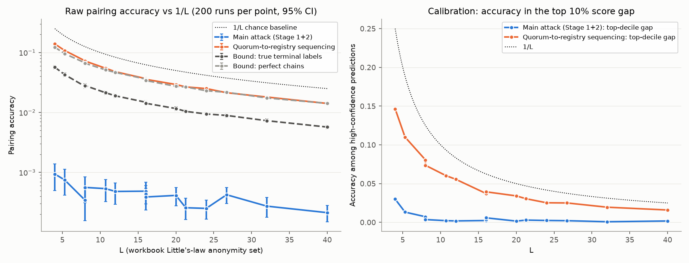

# Level 3 results

The sweep covered all 15 settings in the workbook table, with 200 independent runs each (3,000 runs), plus probes and sensitivity checks (280 runs). Each run simulates 90 minutes of traffic, about 3 million observed messages. Only submissions made in the 40 minutes after a 20-minute warm-up are scored.

Methods and every modelling choice are described in [`README.md`](README.md). The machine-readable results are in `results/summary.json` and `results/summary.csv`.

## Headline

**Neither attack beat the workbook's 1/L baseline at any setting**, from L = 4 to L = 40. The upper end of every 95% confidence interval stays below 1/L. So the sweep does not find an L floor below which the attack succeeds. Measured against the workbook's criterion, it finds none inside the tested range.

That does not mean the traffic carries no linking signal. The two attacks differ:

- **Main attack** (chain reconstruction followed by origin-time grouping). This is at chance. It pairs correctly 0.02–0.09% of the time, which matches random assignment over the same candidate pairs. The failure happens in Stage 1: the node-wide lottery mixes held packets almost uniformly, so per-hop matching succeeds only 1.4–2.2% of the time.
- **Quorum-to-registry sequencing attack.** This one carries a real, if weak, signal. At every setting it is **4–6× better than random assignment**, at about **0.58 / L** in absolute terms. The cause is that F and I post to the registry soon after the gatekeeper quorum forms, and that quorum follows the validator round trip in time. The attack never becomes *confident*, though. No prediction in any setting had a top-vs-runner-up score gap of 2 nats or more. Accuracy in the top 10% of score gaps is only slightly above the overall accuracy (for example 14.6% vs 13.9% at L = 4). The attacker also cannot pick out which of its guesses are right.

On the workbook's two-part criterion:

1. **Raw accuracy vs 1/L.** Below 1/L everywhere, for both attacks.
2. **Calibration.** Fails for both attacks: there are no high-confidence predictions to trust.

Both findings hold under the workbook's own framing. The next section explains why "below 1/L" is a weaker guarantee than it sounds.

## Main sweep

Cells show accuracy with a 95% bootstrap CI over runs. "Random-assignment baseline" means the same assignment step applied to random scores over the same feasible pairs.

| Devices | Interval (min) | L | 1/L | Main attack | Sequencing attack | Sequencing ÷ random-assignment baseline | Bound: perfect chains | Bound: true terminals | Stage 1 hop accuracy |
|---|---|---|---|---|---|---|---|---|---|
| 40 | 10 | 8.0 | 0.125 | 0.03% [0.02–0.06] | 7.3% [7.0–7.5] | 4.5× | 6.7% | 2.7% | 2.0% |
| 40 | 15 | 5.3 | 0.189 | 0.07% [0.04–0.11] | 10.8% [10.3–11.3] | 4.7× | 9.6% | 4.3% | 2.2% |
| 40 | 20 | 4.0 | 0.250 | 0.09% [0.05–0.14] | 13.9% [13.3–14.5] | 4.0× | 12.2% | 5.7% | 2.2% |
| 80 | 10 | 16.0 | 0.062 | 0.04% [0.03–0.06] | 3.7% [3.6–3.9] | 4.7× | 3.5% | 1.5% | 1.8% |
| 80 | 15 | 10.7 | 0.093 | 0.05% [0.03–0.08] | 5.5% [5.2–5.7] | 4.8× | 5.1% | 2.1% | 2.0% |
| 80 | 20 | 8.0 | 0.125 | 0.06% [0.03–0.08] | 7.2% [6.9–7.5] | 4.4× | 6.6% | 2.8% | 2.0% |
| 120 | 10 | 24.0 | 0.042 | 0.03% [0.02–0.03] | 2.5% [2.4–2.6] | 5.4× | 2.3% | 0.9% | 1.7% |
| 120 | 15 | 16.0 | 0.062 | 0.05% [0.03–0.07] | 3.7% [3.5–3.8] | 4.8× | 3.6% | 1.5% | 1.8% |
| 120 | 20 | 12.0 | 0.083 | 0.05% [0.03–0.07] | 4.8% [4.6–5.0] | 4.3× | 4.7% | 1.9% | 1.9% |
| 160 | 10 | 32.0 | 0.031 | 0.03% [0.02–0.04] | 1.8% [1.7–1.9] | 5.8× | 1.7% | 0.7% | 1.5% |
| 160 | 15 | 21.3 | 0.047 | 0.03% [0.02–0.04] | 2.7% [2.6–2.8] | 4.9× | 2.7% | 1.0% | 1.7% |
| 160 | 20 | 16.0 | 0.062 | 0.04% [0.02–0.05] | 3.6% [3.4–3.7] | 4.9× | 3.4% | 1.4% | 1.8% |
| 200 | 10 | 40.0 | 0.025 | 0.02% [0.01–0.03] | 1.4% [1.4–1.5] | 5.5× | 1.4% | 0.6% | 1.4% |
| 200 | 15 | 26.7 | 0.037 | 0.04% [0.03–0.06] | 2.1% [2.0–2.2] | 5.2× | 2.2% | 0.9% | 1.6% |
| 200 | 20 | 20.0 | 0.050 | 0.04% [0.03–0.06] | 2.9% [2.8–3.0] | 5.5× | 2.7% | 1.2% | 1.7% |

### Reading the bounds

The two "bound" columns are not attacks. Each uses ground truth that the observer does not have, to measure how much information exists at a given stage:

- **Perfect chains.** Stage 2 is given the true 3-hop chains. Even then it reaches only about 0.55/L. The reason is the device's independent per-channel hold: the only thing tying a credential chain to its content chains is the difference of two independent lottery draws.
- **True terminal labels.** This is the workbook's original terminal-timing attack, given oracle labels. It reaches about 0.23/L. Terminal times are six lottery draws apart, which is even less informative than the origins.

So the main attack's near-zero result is not only a weakness of hard-decision chain reconstruction. **Even perfect reconstruction would stay below 1/L.** A better Stage 1, such as soft or probabilistic inference instead of an assignment, is capped by the perfect-chains column.

### Why "below 1/L" is weaker than it sounds

1/L assumes the only competitors are the L submissions in flight during a 2-minute window. The actual pairing window is much wider: a device hold of up to 5 minutes per channel, plus the relay hops. As a result, random assignment over the real candidate set scores about 5× below 1/L. The sequencing attack sits above that real chance level, at every setting, with tight intervals.

A reviewer could reasonably call that a measurable leak even though it never crosses 1/L. It is **weak and uncalibrated**: the attacker gets about one right in 1.7L tries and cannot tell which one. That is the "materially weaker privacy failure" the workbook describes.

## Probes (80 devices, 15-min interval, L = 10.7; 20 runs each)

| Probe | Stage 1 hop accuracy | Main attack | Top-decile accuracy (main) | Origin-anchored: device → content terminal |
|---|---|---|---|---|
| Sweep model: node-wide relay clock, per-channel device phase | 2.0% | 0.05% | 0.2% | 0.10% |
| Per-packet relay timers (phase leak at relays) | **98.0%** | 5.2% | 5.9% | **99.9%** |
| One shared device clock (phase leak at the device) | 1.9% | 0.0% | 0.0% | 0.02% |
| Both leaks together | **97.7%** | **65.9%** [64.3–67.5] | **91.0%** | **99.9%** |
| Positive control: lottery off | 99.9% | **99.2%** | 99.8% | 100% |

- **The attack works.** With the lottery switched off, the same code pairs 99.2% of submissions. With both phase leaks present, it pairs 65.9%, and it is well calibrated: 91% accurate among its most confident tenth. The near-zero results in the sweep come from the defence, not from a broken attack.
- **Per-packet timers leak at every hop.** With them, the arrival phase survives each hop to within milliseconds, and hop-by-hop tracing becomes 98% accurate. The main attack still fails in that probe, but only because the per-channel device phase blocks Stage 2. Anyone who can see device IPs traces device → ContentHash 99.9% of the time. **The node-wide clock is load-bearing and should be specified explicitly.** The workbook's "each held packet as a task rolling its release probability each tick" reads most naturally as the leaky version.
- **A shared device clock leaks at the origin.** With perfect chains, it would let Stage 2 pair 68% of submissions (bound column in `summary.json`). **The per-channel device phase is also load-bearing.** Each defence covers the other's stage. Remove both, and the attack succeeds with confidence.

## Origin-anchored trace (reported separately, as agreed)

Here the observer can see each device's IP at its first hop.

- **Linking a device's credential submission to its content submission at the first hop is trivial.** All three first-hop packets leave from the device's IP. 37–61% of submissions are fully unambiguous, meaning the device has no other submission within ±5 minutes. The remaining submissions are still attributed to the right device, but can be confused with that device's other submissions.
- **Linking the device to its ContentHash is not trivial.** That requires tracing through two relay hops. Under the sweep model it succeeds only 0.05–0.11% of the time. The relays mix well even when the start point is known.
- **With per-packet timers**, the same trace succeeds 99.9% of the time.

So the unmodelled anonymizing layer is the only thing protecting the first-hop link itself. That is exactly the precondition you flagged. Given that layer, the timing defence protects the path onward to the ContentHash.

## Background and blend-in (120 devices, 15-min interval, L = 16; 50 runs each)

| Background clients per node | Stage 1 hop accuracy | Main attack | Sequencing attack |
|---|---|---|---|
| 0 | 8.5% | 0.12% | 3.9% |
| 5 | 5.1% | 0.06% | 3.9% |
| 25 (sweep) | 1.8% | 0.05% | 3.7% |
| 100 | 0.6% | 0.01% | 3.9% |

- Background traffic makes first-hop matching harder, but the main attack is at chance even with **no** background: the lottery alone defeats it.
- Background does nothing against the sequencing attack. Its signals are validator replies and registry gossip bursts, and neither can be confused with background traffic.
- **Sanity check on non-blending traffic.** No keepalive ever entered a reconstructed chain. Across all 3,000 sweep runs, 117 bulk-transfer records did (out of about 11.7 million chain slots). Each was the final, partial record of a transfer, which can land in the 442–482 B window by chance.
- **Observer reads the record type vs ignores it.** This makes no measurable difference: 0.05% main accuracy either way. Ignoring it adds about 1,000 DNS responses per run to roughly 37,000 in-window background records.

## Findings that don't depend on the sweep

1. **The Size Verification tab leaves out one encryption layer.** Every relay leg carries the nested payload-key ECIES layer (C-/F-/I-device_pk), which adds 49 B. Measured with real crypto:
   - Cred-1/2: 235 B (the tab says 186)
   - Cred-3: 219 B (the tab says 170)
   - ContA/B-1/2: 162 B (the tab says 113)
   - ContA/B-3: 146 B (the tab says 97)
   
   GK, CV-1, CV-2 and Reg match the tab exactly. The largest leg is still GK at 289 B, so padding into 420–460 B still works. Only the tab's arithmetic needs correcting.
2. **RFC 7685 is cited backwards** (Simulation Parameters!D3). The padding extension exists to push ClientHellos *out* of the 256–511 B range; some middleboxes hang on those sizes. Real OpenSSL ClientHellos:
   - with padding: 517 B on the wire
   - without padding: 293–326 B
   - resumed sessions: 556–608 B
   
   **None of the 360 captured ClientHellos landed in Birthmark's 442–482 B window.** Only 0.7% of DNSSEC responses did. The traffic that actually overlaps Birthmark on the wire is TLS 1.3 application-data records: 2.1% of them fall in the window.

   In this experiment, that is enough cover, because the lottery does the work, not the blend-in. But the rationale for the padding range needs rewriting.
3. **The observer can find C and the moment each credential chain ends.** C contacts the validator immediately, with no lottery. This lets the observer detect credential terminals with over 99% reliability. It isn't a link by itself, but it is what makes the sequencing attack possible. A lottery hold before CV-1, or a hold at F/I before posting to the registry, would target that attack directly.
4. **The lottery's mean hold is 111 s, not 120 s.** Truncation at 30 ticks shortens it. The L column was used as printed.

## Where this model is generous to the defender

- The observer does not use TCP 5-tuples. A real observer would see connection identity, which lets it discard background request/response transactions at ingress. That would mainly help Stage 1 at the first hop. Stage 2 would still be capped by the perfect-chains bound.
- The sequencing attack pairs the F and I posts independently. A joint model would exploit the fact that both post within about 10 s of the same quorum, and could do somewhat better.
- F/I polling behaviour is an assumption (10 s tick, post on 2-of-3). The sequencing result depends on it directly.
- Latencies, the gossip envelope size, and the background mix are defaults. They are listed in `params.py`.
